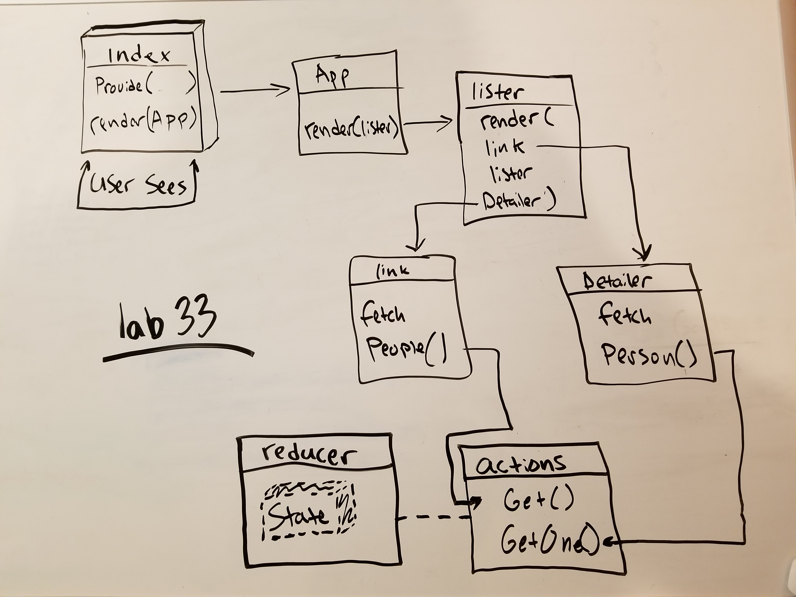

## Remote API's w/React
This app demos hitting the Star Wars API `https://swapi.co/` and returning people data.

### Getting Started
* Fork and clone this repo to your local machine
* Run `npm install` from your cmd line
* Run `npm start` from your cmd line, refresh the browser and check it out!

### Link
* You can also view this project at [Code Sandbox](https://codesandbox.io/s/xpx8x3yrvw)

### UML

